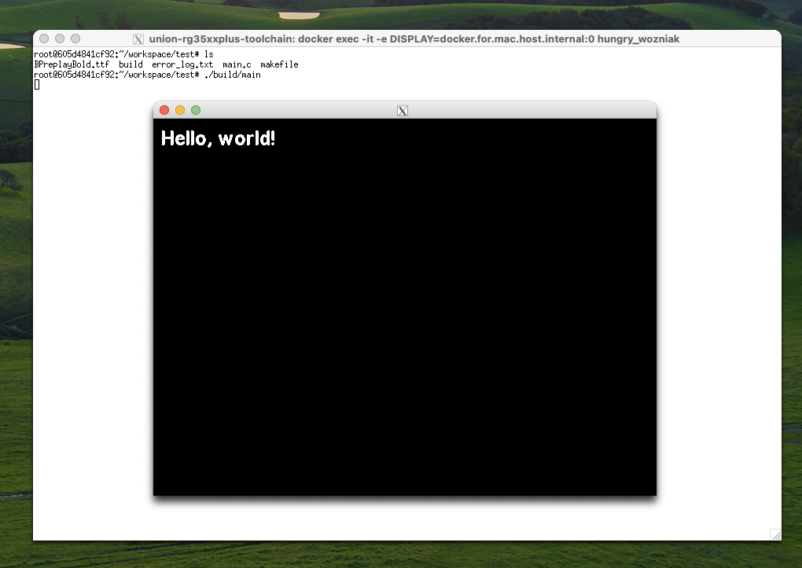

# Toolchain Docker image

Based on the [Trimui toolchain Docker image](https://git.crowdedwood.com/trimui-toolchain/) by neonloop.

## Installation with GUI



### NOTE: Only tested in macOS 14
If you need a GUI for your application and you want to test it, you can:
- Install XQuartz
- In a terminal, `cd` into the root of this directory and run `./before-run.sh`
- Open a XQuartz shell with: `open -a XQuartz`
- Once inside the XQuartz shell `cd` into the root of this directory and run `make shell`

I included a simple application that displays "Hello, world" on screen with the MinUI font. To run the application:
```bash
cd test
make
./build/main
```
If any error occurs a file named `error_log.txt` will be created to show any errors occurred.


## Normal Installation 

With Docker installed and running, `make shell` builds the toolchain and drops into a shell inside the container. The container's `~/workspace` is bound to `./workspace` by default. The toolchain is located at `/opt/` inside the container.

After building the first time, unless a dependency of the image has changed, `make shell` will skip building and drop into the shell. Running `make shell` from another window while already in a running shell will attach to the already running image.

## Workflow

- On your host machine, clone repositories into `./workspace` and make changes as usual.
- In the container shell, find the repository in `~/workspace` and build as usual.

See [setup-env.sh](./support/setup-env.sh) for some useful vars for compiling that are exported automatically.

## Docker for Mac

Docker for Mac has a memory limit that can make the toolchain build fail. Follow [these instructions](https://docs.docker.com/docker-for-mac/) to increase the memory limit. Also, docker on the M1 currently has a bug that stops reporting build progress after 5 minutes or so. The initial build takes about 15 minutes on my M1 so just be patient once you see `[output clipped, log limit 1MiB reached]`, it should get there.